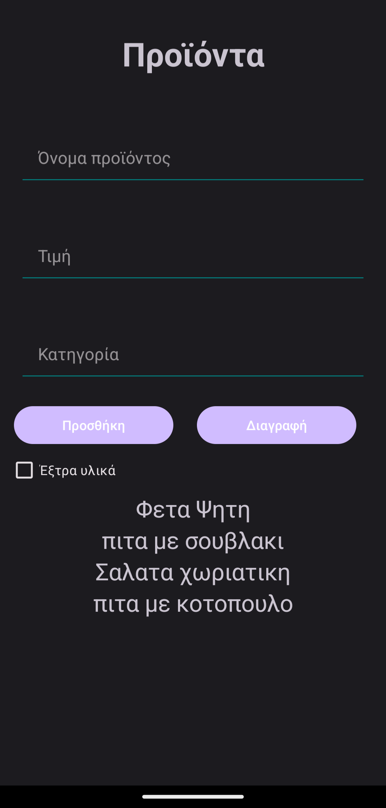
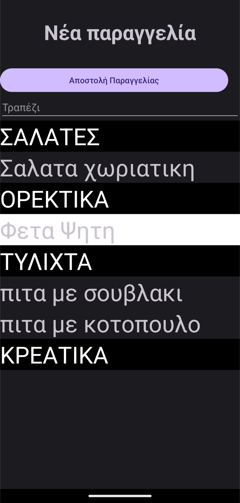
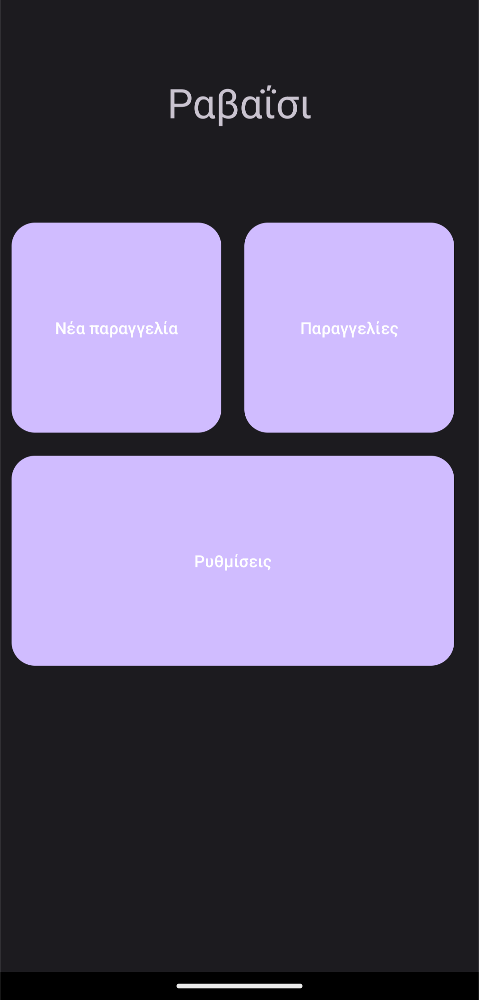

# RavaisiPDA

## Description

RavaisiPDA consists of an Android application that allows waiters to send orders directly to a PC in the kitchen, where a main program is running. The main program is developed in C# using WPF and the .NET Framework. Orders are sent to a MySQL database hosted on an XAMPP server, using PHP for the backend.

## Links

* Android Application: [RavaisiPDA Android App Repository](https://github.com/komoro13/RavaisiPDA)
* Desktop Application: [RavaisiPDADesktop WPF](https://github.com/komoro13/RavaisiPDADesktop_WPF)
* Old Desktop Application: [Ravaisi PDA Desktop (WinForms)](https://github.com/komoro13/Ravaisi_PDA_Desktop)
* Backend: [RavaisiPHP](https://github.com/komoro13/RavaisiPHP)

## Features

* **Android Application**: 
  * Waiters can create and send orders directly.
  * Four main sections: New Order, Orders, Settings.

## Android Application Details

### Sections

1. **New Order**: 
   * Create and send new orders to the kitchen.

2. **Orders**: 
   * View current and pending orders.
   * Press once on the table name to add more products.
   * Long press to read the order.

3. **Settings**: 
   * Manage categories, products, and toppings.
   * Set the static IP address of the kitchen PC.

### Adding Products, Categories, and Toppings
* Specify:
  * **Product**: Name, Price, Category, and Available Toppings.
  * **Category**: Name.
  * **Topping**: Name and Extra Charge.

## Basic Functionality

### 1. Adding a product

This function handles the addition of a new product to the database.

```java
private class addProduct extends AsyncTask {
        //This function adds a new product to the database. It encodes the product and sends it
        //to the AddProducts php file located in the main PC
            @Override
            protected Object doInBackground(Object[] objects) {
                String data = URLEncoder.encode("name") + "=" + URLEncoder.encode(product)
                        + "&" + URLEncoder.encode("price") + "=" + URLEncoder.encode(price)
                        + "&" + URLEncoder.encode("category") + "=" + URLEncoder.encode(category)
                        + "&" + URLEncoder.encode(("toppings")) + "=" + URLEncoder.encode((productTops));
                Log.d("PaymentActivity", data);

                try {

                    URL url = new URL(ADD_PRODUCT);
                    HttpURLConnection client = (HttpURLConnection) url.openConnection();
                    client.setRequestMethod("POST");
                    client.setDoOutput(true);
                    OutputStream outputPost = new BufferedOutputStream(client.getOutputStream());
                    BufferedWriter writer = new BufferedWriter(new OutputStreamWriter(outputPost, "UTF-8"));
                    writer.write(data);
                    writer.flush();
                    writer.close();
                    outputPost.close();
                    client.connect();

                    String message = client.getResponseMessage();
                    Log.d("PaymentActivity", message);
                    if (!message.equals("OK"))
                    {
                        Toast.makeText(AddProductsActivity.this, "Error sending product", Toast.LENGTH_SHORT).show();
                        finish();
                    }
                    InputStream inputStream = new BufferedInputStream(client.getInputStream());
                    BufferedReader reader = new BufferedReader(new InputStreamReader(inputStream, "UTF-8"));
                    StringBuilder stringBuilder = new StringBuilder();
                    for (int ch; (ch = reader.read()) != -1; )
                        stringBuilder.append((char) ch);
                    String response = stringBuilder.toString();
                    Log.d("PaymentActivity", "Server: " + response);
                    runOnUiThread(new Runnable() {
                        @Override
                        public void run() {
                            Toast.makeText(AddProductsActivity.this, "Product added successfuly!", Toast.LENGTH_SHORT).show();
                        }
                    });
                    return null;

                } catch (Exception ex) {
                    Log.d("PaymentActivity", ex.getMessage());
                    Toast.makeText(AddProductsActivity.this, "Error sending product", Toast.LENGTH_SHORT).show();
                    finish();
                }
                return null;
            }
        }
```
#### Explanation of the Add Product Function

* **Functionality**: This `AsyncTask` class is designed to handle the network operation of adding a product to the MySQL database asynchronously.
* **Data Encoding**: 
   * The product's name, price, category, and toppings are URL-encoded to ensure special characters are properly handled when sent.
* **Network Request**: 
   * A POST request is made to the `AddProducts.php` file on the main PC.
   * The response from the server is checked; if it is not "OK," an error message is displayed, and the activity is finished.
* **User Feedback**: 
   * If the request is successful, a toast message informs the user that the product was added successfully.
...

### 2. Order Serialization 

```Java
String createOrderString() {
            String order = "{table: " + this.table + "}&{price: "+ String.valueOf(this.price) + "|";
            for (Product product : products) {
                order = order + "{" + product.getProductString() + "[";
                for (Item item : product.items) {
                    if (item.comments.equals(null))
                        item.comments = "";
                    order += item.getItemString().split("\n")[1] + "<" + item.comments +">" +"(" + item.getQuantity() + ")" + "$" + item.calculatePrice().toString() + "$" + "_";
                }
                order = order + "]";
                order = order + "}";
                order = order + "&";
            }
            order.replace("\n", "-");
            order.replace("&}", "");
            order.replace("&\0", "");
            return order;
        }
```
### Explanation of the `createOrderString` Function in the Order Class

The `createOrderString` function in the `Order` class constructs a serialized representation of an order using a custom protocol designed by you.

### Functionality
* **Purpose**: This function builds a string format for the entire order by iterating through the order details, including table information, total price, products, and associated items.
  
### Composition
* **Table and Price**: The order string begins with the table number and total price.
* **Product Details**: Each product's string representation is concatenated into the order string, formatted with:
  * Product name and additional properties.
  * For each item in the product, details such as comments, quantity, and price are included.
  
### Formatting
* The function replaces newline characters with hyphens for formatting.
* It manages the final formatting by removing any trailing unwanted characters.

### Return Value
* The final serialized string is returned, ready to be sent to the backend for processing.

This custom protocol is crucial for ensuring that orders are formatted correctly for transmission to the kitchen system.


## Screenshots

Here are some screenshots of the RavaisiPDA Android application:

* **Add Product**:


* **New Order**:


* **Main Menu**:


  ## Usage

1. **Add Categories, Products, and Toppings**: 
   * Use the Settings section to add new categories, products, and toppings.

2. **Set Up**: 
   * Ensure the kitchen PC's IP address is set in the Settings section of the Android app.

3. **Send an Order from the Android App**: 
   * Create and submit a new order.

4. **Notifications**: 
   * If everything works fine, the desktop app will make a notification sound and update the loaded orders.
  
## Installation

### Prerequisites

* XAMPP Server with MySQL.
* PHP files for backend functionality.

### Setup Instructions

1. **Load the Database**: 
   * Import the MySQL database into the XAMPP server.

2. **Configure PHP**: 
   * Place the PHP files in the `htdocs` folder.

3. **Set Up the Android App**: 
   * Specify the IP address of the kitchen PC within the app.

## Contributing

Contributions are welcome! Here’s how you can help improve the project:

1. **Fork the repository**: Create your own copy of the project on your GitHub account.
2. **Make your changes**: Implement your improvements or fixes in a new branch.
3. **Test your changes**: Ensure that everything works as expected.
4. **Submit a pull request**: Submit your changes back to the main repository with a description of what you have done.

### Guidelines

* Follow the project’s coding style.
* Write clear and descriptive commit messages.
