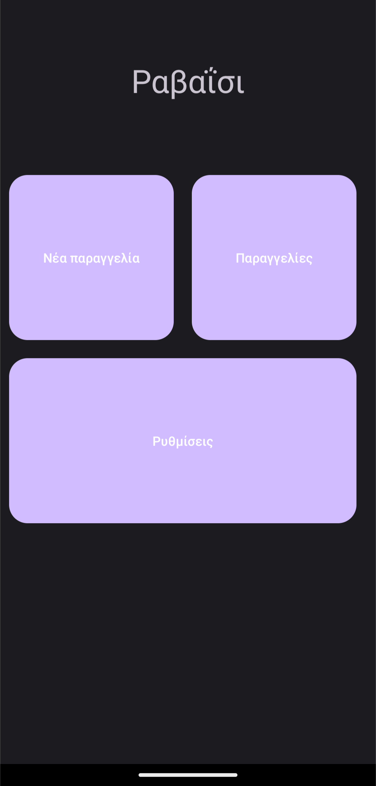
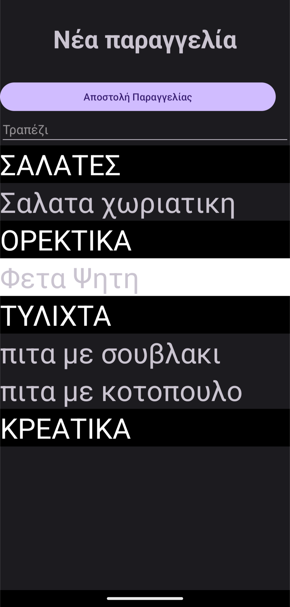
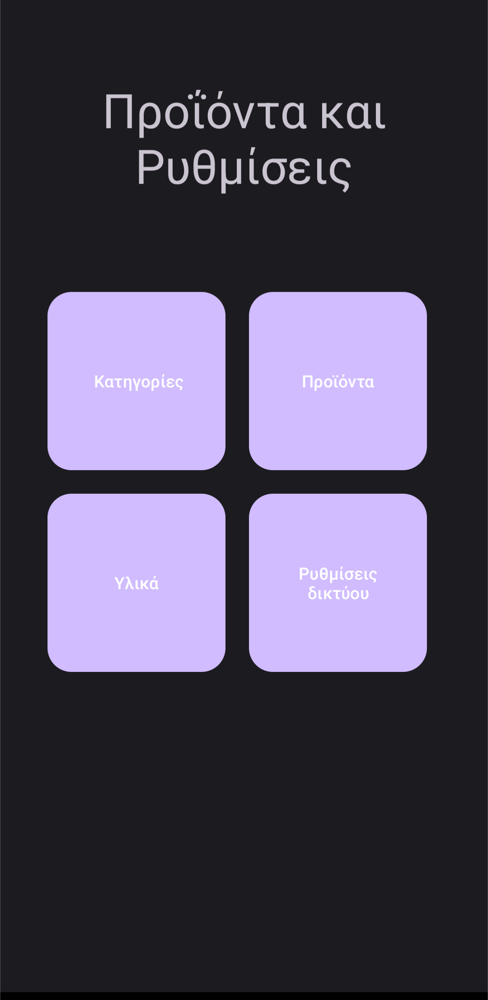

# Ravaisi PDA

Android-based restaurant ordering application developed as part of the **Ravaisi restaurant management system**.

Ravaisi PDA was designed for waiters to manage tables, create orders, browse products, and send orders directly to the restaurant's backend from an Android device.

The application communicates with a PHP/MySQL backend, while submitted orders can be received and managed through the separate Ravaisi desktop application.

> **Project status:** Legacy / completed project.  
> This repository is preserved as part of my earlier software development work.

---

## Screenshots

<p align="center">
  
  
  
</p>

<p align="center">
  <i>Main menu, order creation, and product management interfaces.</i>
</p>

---

## System Architecture

Ravaisi was developed as a multi-component restaurant management system.

```text
┌─────────────────────┐
│    Android PDA      │
│   Waiter Client     │
└──────────┬──────────┘
           │
           │ HTTP
           ▼
┌─────────────────────┐
│     PHP Backend     │
│        API          │
└──────────┬──────────┘
           │
           ▼
┌─────────────────────┐
│       MySQL         │
│      Database       │
└──────────┬──────────┘
           │
           ▼
┌─────────────────────┐
│   Desktop Client    │
│      C# / WPF       │
└─────────────────────┘
```

The Android application provides the waiter-facing interface, while the backend handles communication and persistent restaurant data.

---

## Features

- Table selection and management
- Product and menu browsing
- Order creation
- Product quantities and order modification
- Communication with a remote PHP backend
- MySQL-backed restaurant data
- Order transmission from waiter devices
- Integration with the Ravaisi desktop application
- Android interface designed for handheld restaurant use

---

## How It Works

1. The waiter selects a table from the Android application.
2. Products are selected from the restaurant menu.
3. The application builds the order from the selected products and quantities.
4. Order data is sent to the PHP backend through HTTP requests.
5. The backend processes the request and interacts with the MySQL database.
6. The restaurant's desktop software can retrieve and manage submitted orders.

This architecture separates the mobile ordering interface from the backend and desktop management software.

---

## Technologies

### Android Client

- Java
- Android SDK
- Gradle
- HTTP networking
- Asynchronous background requests

### Backend

- PHP
- MySQL
- HTTP-based communication

### Desktop Application

- C#
- WPF
- .NET

---

## Repository Structure

```text
Ravaisi_PDA/
├── app/                 # Android application source
├── gradle/
│   └── wrapper/         # Gradle wrapper
├── rsc/                 # Images and project resources
├── build.gradle
├── gradle.properties
├── gradlew
├── gradlew.bat
├── logotypo.jpg
├── settings.gradle
└── README.md
```

The main Android source code can be found under `app/`.

---

## Related Ravaisi Projects

Ravaisi was split across multiple repositories representing different components and generations of the system.

### Desktop Application

**Ravaisi Desktop**

C# / WPF desktop application used by the restaurant side of the system.

https://github.com/komoro13/Ravaisi_Desktop

### Legacy Desktop Application

**Ravaisi Desktop WinForms**

Earlier Windows Forms implementation of the desktop software.

https://github.com/komoro13/Ravaisi_Desktop_WinForms

### Backend

**Ravaisi PHP**

PHP backend responsible for communication between the clients and the database.

https://github.com/komoro13/Ravaisi_PHP

---

## Development Background

Ravaisi was one of my earlier full-stack software projects and was built to explore the design of a complete client/server system rather than an isolated application.

The project combines several technologies and platforms:

```text
Android / Java
      │
      ▼
HTTP / PHP
      │
      ▼
    MySQL
      │
      ▼
C# Desktop Software
```

Developing the system involved mobile application development, asynchronous network communication, backend programming, database integration, data serialization, and desktop application development.

The project is retained in its original form as a record of that development work.

---

## Status

**Completed / Legacy**

This is an older project and is no longer actively developed. The source code is preserved primarily for reference and portfolio purposes.
